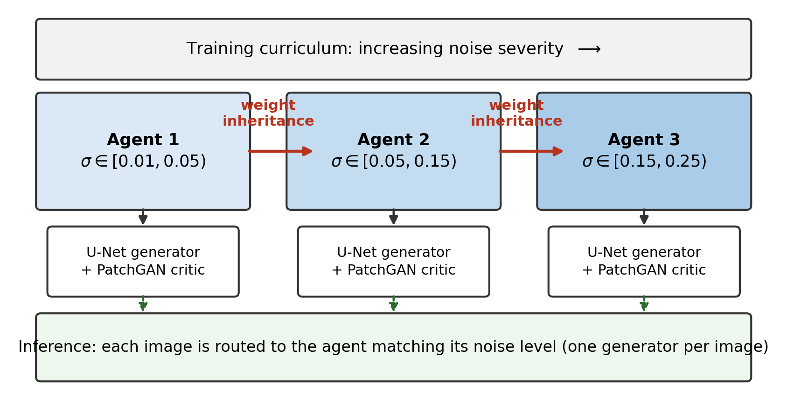
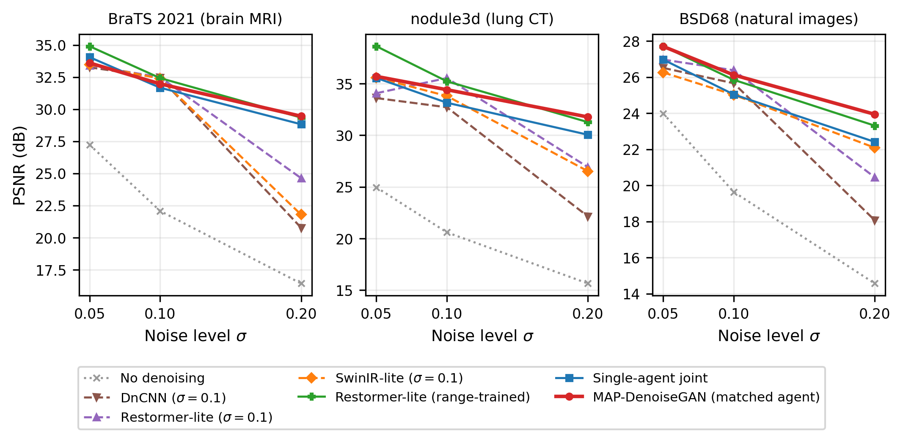

# MAP-DenoiseGAN: A Noise-Adaptive Mixture-of-Experts Framework for Medical Image Denoising

Code, results and figures for **MAP-DenoiseGAN**, a multi-agent denoising framework in which noise-regime specialists are trained as a curriculum of increasing noise severity, with each agent inheriting the full parameter set of its predecessor.

> **Status:** research code accompanying a manuscript in preparation. This repository is private.



## Overview

Medical image denoisers usually train for one noise level, or for one broad noise range. MAP-DenoiseGAN instead trains three conditional-GAN specialists:

| Agent | Training noise (σ) | Initialised from |
|---|---|---|
| `agent1_low` | 0.05 | scratch |
| `agent2_medium` | 0.10 | `agent1_low` |
| `agent3_high` | 0.20 | `agent2_medium` |

Each test image is routed to one specialist, either by its known noise level (oracle routing) or by a small learned noise-level estimator (estimated routing).

The system is analysed as a **mixture of experts** using the specialisation–diversity–routing decomposition of Bause et al. (2026). Their Theorem 2.4, stated for Brier loss, is adapted to squared-error image restoration and verified numerically (max residual 9.3 × 10⁻⁹).

## Key results

Measured on BraTS 2021 brain MRI, a lung-CT nodule dataset (NoduleMNIST3D) and CBSD68:

- **Specialisation gain at high noise:** at σ = 0.20 the matched agent beats a compute-matched joint model by **+0.81 ± 0.17**, **+1.54 ± 0.12** and **+1.27 ± 0.44 dB** (4 seeds per dataset, 4/4 seeds positive, paired p ≤ 0.011).
- **Routing regret falls to zero as noise grows:** the noise-matched agent is the per-image best agent for 99.6–100% of images at σ = 0.20 (vs. 2.7–54.4% at σ = 0.05).
- **Correct sign prediction:** the decomposition correctly predicts whether ensembling beats the joint model in all 9 dataset × noise combinations.
- **Weight inheritance** cuts the cost of each extra specialist by 10× to ≥30× in epochs to matched quality.
- **Speed:** the deployed system runs 5.3× faster per image than a range-trained transformer baseline of comparable quality.
- **Baseline protocol matters:** training classical baselines at a single noise level substantially overstates the benefit of noise-adaptive denoising; range-trained controls are recommended.



## Repository structure

```
├── src/                         # All Python code
│   ├── paths.py                 # Central path configuration (edit or set env vars)
│   ├── models.py                # U-Net generator + conditional PatchGAN discriminator
│   ├── utils.py                 # Noise model (Gaussian + Poisson), PSNR/SSIM, seeding
│   ├── muon.py                  # Muon optimiser (ablation)
│   ├── prepare_*.py             # Dataset preparation
│   ├── train_*.py               # Agent, baseline and noise-estimator training
│   ├── eval_*.py                # Evaluation (cross-dataset, seeds, downstream, routing)
│   ├── measure_theorem_terms.py # Specialisation / diversity / routing terms
│   ├── verify_prop2.py          # Numerical check of Proposition 2
│   ├── make_*.py                # Regenerate paper tables and figures
│   ├── check_*.py               # Consistency checks between results and manuscript
│   └── external/                # Baseline model definitions (see below)
├── scripts/                     # Shell wrappers
├── checkpoints/noise_estimator/ # Trained noise-level estimators (~1 MB each)
├── results/
│   ├── tables/                  # All result tables (CSV, JSON, LaTeX)
│   ├── figures/                 # All figures (PDF + PNG)
│   └── estimated_routing/       # Estimated-routing evaluation outputs
└── docs/cross_dataset_report.md # Detailed cross-dataset experiment log
```

## Installation

```bash
git clone https://github.com/umairkhawaja48-beep/MAP-DenoiseGAN-A-Noise-Adaptive-Mixture-of-Experts-Framework-for-Medical-Image-Denoising.git
cd MAP-DenoiseGAN-A-Noise-Adaptive-Mixture-of-Experts-Framework-for-Medical-Image-Denoising
conda create -n mapdenoise python=3.10 -y
conda activate mapdenoise
pip install -r requirements.txt
```

A CUDA GPU is recommended for training.

### Paths

By default, data is read from `./data` and all outputs go to `./outputs`. To use other locations:

```bash
export MAP_DATA_ROOT=/path/to/data
export MAP_RESULTS_ROOT=/path/to/outputs
```

### Baseline model files

The DnCNN, Restormer-lite, SwinIR-lite and segmentation U-Net definitions are not yet included. Scripts that use them (baseline training, cross-dataset evaluation, downstream segmentation, table/figure generation) need these files in `src/external/`. See [`src/external/README.md`](src/external/README.md).

## Datasets

| Dataset | Modality | Train / Val / Test | Source |
|---|---|---|---|
| BraTS 2021 | Brain MRI (axial slices) | 8000 / 3000 / 5000 | BraTS 2021 challenge |
| nodule3d | Lung CT (nodule slices) | 1158 / 165 / 310 | MedMNIST3D NoduleMNIST3D |
| CBSD68 | Natural images (grayscale) | 360 / 40 / 68 | BSD400 train / BSD68 test |

All images are resized to 128 × 128 and scaled to [0, 1]. Noise is Gaussian (σ) plus Poisson shot noise (`src/utils.py::add_noise`). Datasets are not redistributed here; download them from the original sources.

```bash
cd src
python prepare_cross_dataset_data.py --dataset nodule3d_128
python prepare_cbsd68.py
python prepare_fixed_sigma_eval.py --dataset nodule3d_128
```

## Usage

All commands run from `src/`.

**Train the specialist chain** (each agent inherits from the previous one; checkpoints are written under `$MAP_RESULTS_ROOT/map_project/cross_dataset/`):

```bash
python train_cross_dataset_agent.py --dataset nodule3d_128 --agent agent1_low    --out-dir nodule3d_128/agent1_low
python train_cross_dataset_agent.py --dataset nodule3d_128 --agent agent2_medium --out-dir nodule3d_128/agent2_medium \
    --init-from $MAP_RESULTS_ROOT/map_project/cross_dataset/nodule3d_128/agent1_low/checkpoints/generator_last.pt
python train_cross_dataset_agent.py --dataset nodule3d_128 --agent agent3_high   --out-dir nodule3d_128/agent3_high \
    --init-from $MAP_RESULTS_ROOT/map_project/cross_dataset/nodule3d_128/agent2_medium/checkpoints/generator_last.pt
python train_cross_dataset_agent.py --dataset nodule3d_128 --agent joint         --out-dir nodule3d_128/joint
```

Defaults: 30 epochs, batch size 32, lr 2e-4, λ_rec = 70, seed 42.

**Baselines:**

```bash
python train_cross_dataset_baseline.py ...   # fixed-σ DnCNN / Restormer-lite / SwinIR-lite
python train_range_baseline.py ...           # range-trained controls
```

**Evaluate:**

```bash
python eval_cross_dataset.py --dataset nodule3d_128   # PSNR/SSIM vs. baselines (Tables 3, 6)
python eval_seed_sweep.py                        # seed variance (Table 7)
python measure_theorem_terms.py                  # MoE decomposition terms (Table 8)
python verify_prop2.py                           # Proposition 2 check (Table 9)
python eval_downstream_map.py                    # downstream tumour segmentation Dice (Table 5)
```

**Estimated (blind) routing:**

```bash
bash ../scripts/run_estimator.sh   # train noise-level estimators
bash ../scripts/run_eval.sh        # compare estimated vs. oracle routing
```

Pretrained estimators are in `checkpoints/noise_estimator/`.

**Regenerate tables and figures:**

```bash
python make_bspc_tables.py
python make_bspc_figures.py
python make_fig7.py
python make_fig8.py
```

## Results files

| File | Content |
|---|---|
| `table1_datasets` | Dataset statistics |
| `table2_complexity` | Parameters and inference time |
| `table3_main_psnr` | Main PSNR/SSIM comparison |
| `table4_training_efficiency`, `table4b_inheritance_speedup` | Training cost and inheritance speed-up |
| `table5_downstream_*` | Downstream segmentation Dice |
| `table6_replication` | Cross-dataset replication |
| `table7_seed_*` | Seed variance and statistics |
| `table8_theorem_*` | MoE decomposition terms and identity check |
| `table8b_brain_tumor_muon` | Muon optimiser ablation |
| `table9_*` | Generalisation and Proposition 2 check |
| `routing_comparison`, `estimator_*` | Estimated routing |
| `key_numbers.json` | Headline numbers |

## License

All rights reserved. A license will be added on publication.
